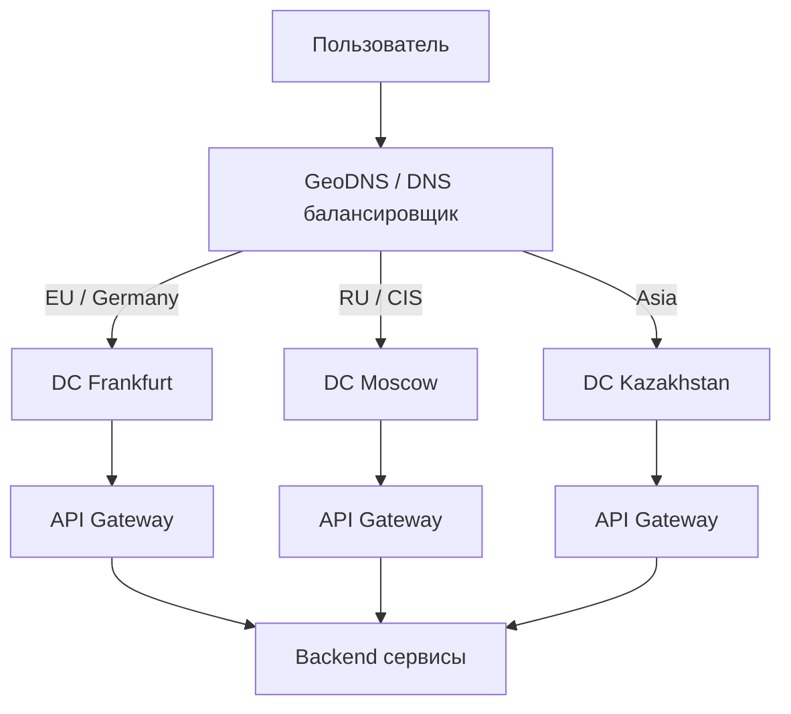
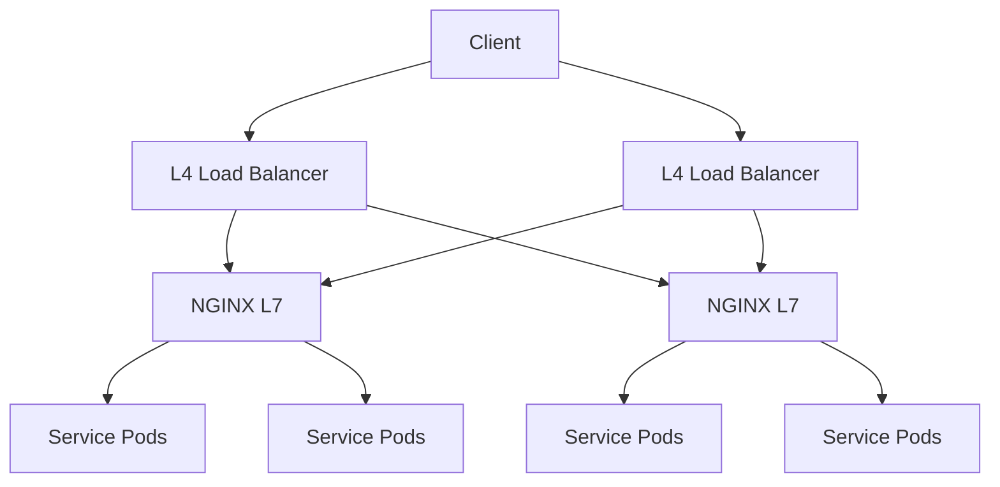
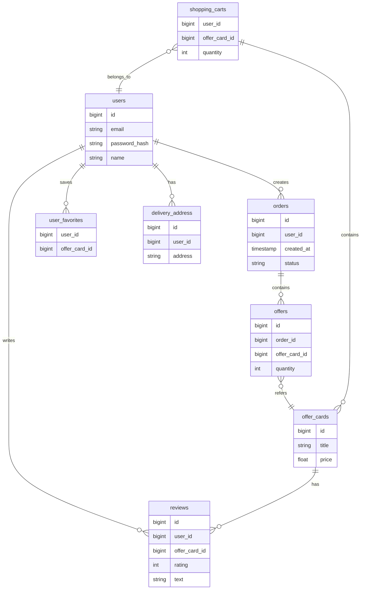

# MVP приложения маркетплейса по аналогии с Yandex Market

## 1. Тема и целевая аудитория

### 1.1. Тема проекта
Сервис агрегации товаров и предложений интернет-магазинов с возможностью поиска, сравнения цен и оформления заказа (MVP Яндекс Маркета).

### 1.2. Обоснование ниши
Существуют крупные аналоги:
- Wildberries
- Ozon
- Avito

Это подтверждает наличие устойчивого спроса и большой аудитории.

### 1.3. Целевая аудитория
Пользователи, совершающие покупки в интернете.

Размер аудитории:
MAU ~40 млн пользователей
DAU ~8 млн пользователей

География:

страны СНГ

### 1.4. MVP функционал
1. Поиск товаров
2. Просмотр карточки товара
3. Добавление товара в корзину
4. Добавление товара в избранное
5. Оформление заказа
6. Просмотр истории заказов

### 1.5. Ключевые продуктовые решения
1. Централизованное хранение каталога товаров
2. Агрегация предложений от разных продавцов
3. Оформление заказа внутри платформы
4. Асинхронное обновление цен

## Продуктовые метрики

По данным [Mediascope](https://mediascope.net/data/) (июнь 2025):
- MAU = 44.5 млн  
- DAU = 8.3 млн  

Коэффициент липучести:
$$
DAU/MAU = \frac {8.3}{44.5} \approx 0.18
$$

---

## Модель данных

Основные сущности:

| Сущность | Описание | Размер |
|----------|----------|--------|
| offers | информация о заказе | 1 KB |
| offer_cards | карточка товара | 50 B |
| reviews | отзывы | 500 B |
| users | профиль пользователя | 300 B |
| delivery_address | адрес доставки | 200 B |
| user_favorites | избранное | 50 B |
| shopping_carts | корзина | 50 B |

---

## Поведение пользователя

Допущения:

- 7 заказов в год на пользователя [DataInsight](https://top100.datainsight.ru/#tab586143958)
- 2 товара в заказе [AdIndex](https://adindex.ru/adindex-market/10/e-commerce/330115.phtml#:~:text=,на%20заказ)  
- Данные о частоте оставления отзывов найти не удалось, предположим что отзывы оставляются в 50% случаев 
- Данные о среднем размере избранного найти также не удалось, предположим что за год их копится 10

---

## Расчёт СРХ (CPX) на пользователя

### В штуках

$$
CPX_{шт} = 7 \cdot (offers + 2 \cdot offercards) + reviews + favorites + user + address
$$

Упрощённо:

$$
CPX_{шт} = 7 \cdot 3 + 4 + 10 + 1 + 1 = 37
$$

---

### В байтах

$$
CPX_{B} = 7 \cdot (1024 + 2 \cdot 300) + 4 \cdot 500 + 10 \cdot 50 + 200 + 300
$$

$$
CPX_{B} = 7 \cdot (1024 + 600) + 2000 + 500 + 200 + 300
$$

$$
CPX_{B} = 7 \cdot 1624 + 3000 = 7168 + 3000 = 10168 = 10^{-5} \ \text{GB}
$$

---

| Метрика | Значение |
|--------|----------|
| CPX (шт) | 37 |
| CPX | 10^-5 GB |

# Технические метрики MVP маркетплейса

## Хранение данных (Storage)

На основе ранее рассчитанного **CPX ≈ 10 KB на пользователя** и аудитории:

- **MAU = 44.5 млн пользователей**

Общий объём хранения:

```
Storage ≈ 44.5M × 10 KB ≈ 445 GB
```

С учётом индексов, реплик и служебных данных:

> **Итог: ~1 TB**

---

## Разбивка по типам данных

| Тип данных        | Количество записей | Размер |
|------------------|------------------|--------|
| Orders           | 311 млн          | ~311 GB |
| Offer cards      | 623 млн          | ~31 GB |
| Reviews          | 155 млн          | ~77 GB |
| Favorites        | 445 млн          | ~22 GB |
| Users + address  | 44.5 млн         | ~22 GB |
| **Итого**        | —                | **~463 GB (~0.45 TB)** |

---

## Сетевой трафик

### Основные типы трафика

- Поиск товаров
- Просмотр карточки товара
- Работа с корзиной
- Оформление заказа

---

## RPS (Requests Per Second)

Расчёты выполнены на основе:

- **DAU = 8.3 млн пользователей**
- Усреднённого пользовательского поведения

### Сводная таблица RPS

| Метод                     | Средний RPS | Пиковый RPS |
|--------------------------|------------|------------|
| Поиск товаров            | 480        | 2400       |
| Просмотр карточки        | 960        | 4800       |
| Добавление в корзину     | 96         | 500        |
| Добавление в избранное   | 10         | 50         |
| Оформление заказа        | 2          | 10         |

---

## Пиковая сетевая нагрузка

Оценка размеров ответов:

| Тип запроса | Средний размер ответа |
|------------|----------------------|
| Поиск      | ~20 KB |
| Карточка   | ~50 KB |
| Корзина    | ~5 KB |
| Заказ      | ~10 KB |

---

### Пиковый трафик

| Тип трафика | Нагрузка |
|------------|----------|
| Поиск      | ~0.4 Gbps |
| Карточки   | ~1.9 Gbps |
| Прочее     | ~0.2 Gbps |
| **Итого**  | **~2.5 Gbps** |

---

## Суточный трафик

```
~2.5 Gbps × 86400 ≈ 27 TB/day
```

С учётом кеширования и CDN:

> **Ожидаемый диапазон: 10–15 TB/day**

---

## Выводы по инфраструктуре

- Требуемая пропускная способность:
  - **не менее 10 Gbps**
- Обязательное использование:
  - CDN для статического контента
  - кеширования (Redis / edge cache)
- Горизонтальное масштабирование backend-сервисов
- Шардирование или репликация БД при росте нагрузки

---

## Итог

| Метрика | Значение |
|--------|----------|
| Хранение | ~1 TB |
| Пиковый трафик | ~2.5 Gbps |
| Суточный трафик | 10–15 TB |
| Максимальный RPS | ~4800 |
---

# Глобальная балансировка нагрузки

## Функциональное разбиение по доменам

Для обеспечения масштабируемости и отказоустойчивости система разделяется на логические домены:

| Домен | Назначение |
|------|-----------|
| search | поиск товаров и фильтрация |
| catalog | карточки товаров |
| orders | оформление и обработка заказов |
| users | профиль пользователя |
| favorites | избранное |
| cart | корзина |
| reviews | отзывы |
| api-gateway | единая точка входа |

Такое разбиение позволяет независимо масштабировать наиболее нагруженные компоненты (например, search и catalog). 

Разбивка происходит не по каждой сущности, а по смыслу:

flowchart TD

UserDomain --> Users
UserDomain --> Address

OrderDomain --> Orders
OrderDomain --> OrderItems

CatalogDomain --> OfferCards

EngagementDomain --> Reviews
EngagementDomain --> Favorites

CartDomain --> Cart

---

## Размещение дата-центров

Целевая аудитория — страны СНГ, поэтому размещение ДЦ выбирается с учётом:

- минимизации latency
- устойчивости к отказам
- географического распределения пользователей

### Выбранные регионы:

| ДЦ | Регион | Причина |
|----|--------|--------|
| DC-1 | Москва | основная аудитория, минимальная задержка |
| DC-2 | Европа (Франкфурт) | резерв + часть трафика |
| DC-3 | Азия (Казахстан) | покрытие восточной части |

---

## Влияние на продуктовые метрики

Геораспределение ДЦ влияет на:

- **Latency (время ответа)**  
  ↓ уменьшение задержки улучшает UX и конверсию

- **Conversion Rate**  
  быстрее загрузка карточек → больше покупок

- **Retention**  
  стабильная работа → выше возврат пользователей

---

## Распределение нагрузки по ДЦ

Исходя из географии пользователей:

| ДЦ | Доля трафика |
|----|-------------|
| Москва | 60% |
| Европа | 25% |
| Азия | 15% |

---

### Пример распределения RPS (пиковый)

| Тип запроса | Общий RPS | Москва | Европа | Азия |
|------------|----------|--------|--------|------|
| Поиск      | 2400     | 1440   | 600    | 360  |
| Карточка   | 4800     | 2880   | 1200   | 720  |
| Корзина    | 500      | 300    | 125    | 75   |
| Заказ      | 10       | 6      | 2.5    | 1.5  |

---

## DNS балансировка

Используется **GeoDNS**:

- пользователь направляется в ближайший ДЦ
- fallback при недоступности региона
- TTL записей: 30–60 секунд

### Схема:



---

## Anycast балансировка

Для edge-уровня (CDN / статический контент):

- один IP адрес объявляется из нескольких ДЦ
- маршрутизация происходит на уровне BGP
- пользователь попадает в ближайшую точку присутствия

### Используется для:

- CDN (изображения товаров)
- кешируемые GET-запросы

---

## Механизмы регулировки трафика

### 1. Health checks
- исключение недоступных ДЦ из балансировки

### 2. Traffic shifting
- постепенное перераспределение нагрузки (например, 60/25/15 → 50/30/20)

### 3. Rate limiting
- ограничение нагрузки на отдельные регионы

### 4. Circuit breaker
- отключение деградирующих сервисов

---

# Локальная балансировка нагрузки

## Общая схема балансировки

Балансировка нагрузки внутри дата-центра реализуется на нескольких уровнях:

- L4 (TCP) балансировка
- L7 (HTTP) балансировка
- балансировка внутри кластера

### Схема



---

## Механизм резервирования

Используется схема:

```
N + 1 (active-passive)
или
N * 2 (active-active)
```

### Формула резервирования:

```
Capacity = (N * Performance) / (N + 1)
```

где:
- N — количество балансировщиков
- +1 — резервный узел

---

## Уровни балансировки

| Уровень | Технология | Назначение |
|--------|-----------|------------|
| L4 | TCP Load Balancer | распределение соединений |
| L7 | NGINX | маршрутизация HTTP |
| Service | Kubernetes | балансировка между pod'ами |

---

## Ограничения балансировщиков

Основные узкие места:

- SSL termination (CPU bound)
- пропускная способность сети
- количество соединений (CPS / RPS)

---

## Производительность SSL termination

Согласно тестам NGINX:

- ~50 000 HTTPS CPS на 1 инстанс (в современных условиях можно брать 30–50k)
- RPS сильно зависит от payload, примем:

```
~20 000 RPS на один NGINX
```

---

## Расчёт количества балансировщиков

### Исходные данные

- Пиковый RPS: **~4800**
- Запас по нагрузке: ×2 (burst + рост)

```
Target RPS = 4800 × 2 = 9600
```

---

### 1. По CPU (SSL termination)

```
1 NGINX ≈ 20 000 RPS
```

```
9600 / 20000 ≈ 0.48
```

для отказоустойчивости потребуется **2 инстанса**

---

### 2. По сети

Если:

- 1 запрос ≈ 50 KB
- 9600 RPS

```
9600 × 50 KB ≈ 480 MB/s ≈ 3.8 Gbps
```
- нужен минимум **10 Gbps интерфейс**

---

## Итог по балансировке

| Уровень | Количество | Обоснование |
|--------|-----------|------------|
| L4 LB | 2 | отказоустойчивость (active-active) |
| L7 (NGINX) | 2–3 | запас по CPU и сети |
| Service layer | auto-scale | Kubernetes |

---

## Отказоустойчивость

- L4 балансировщики работают в active-active
- L7 балансировщики дублируются
- health checks исключают недоступные ноды
- автоматическое масштабирование сервисов

---

# Логическая схема базы данных

## ER-диаграмма



---

## Описание таблиц

| Таблица | Назначение | Размер строки |
|--------|----------|--------------|
| users | пользователи | ~300 B |
| delivery_address | адреса | ~200 B |
| orders | заказы | ~1 KB |
| offers | позиции заказа | ~200 B |
| offer_cards | карточки товаров | ~300 B |
| reviews | отзывы | ~500 B |
| user_favorites | избранное | ~50 B |
| shopping_carts | корзина | ~50 B |

---

## Дополнительные данные

| Тип | Описание | Хранение |
|-----|----------|---------|
| изображения товаров | фото | S3 / object storage |
| кеш поиска | результаты запросов | Redis |
| сессии | авторизация | Redis |
| логи | события системы | ClickHouse / S3 |

---

## Нагрузка (QPS)

### Чтение

| Таблица | QPS (read) | Причина |
|--------|-----------|--------|
| offer_cards | ~3000 | карточки товаров |
| search (cache) | ~2500 | поиск |
| reviews | ~500 | отображение отзывов |
| users | ~300 | профиль |

---

### Запись

| Таблица | QPS (write) | Причина |
|--------|------------|--------|
| orders | ~10 | оформление заказа |
| offers | ~20 | позиции заказа |
| reviews | ~5 | отзывы |
| favorites | ~50 | пользовательские действия |
| carts | ~100 | корзина |

---

## Требования к консистентности

| Домен | Тип консистентности | Обоснование |
|------|------------------|------------|
| orders | strong consistency | критично для денег |
| users | strong consistency | авторизация |
| cart | eventual consistency | допустимы задержки |
| favorites | eventual consistency | не критично |
| reviews | eventual consistency | допустимы лаги |
| catalog | eventual consistency | кешируется |

---

## Распределение нагрузки по ключам

### Основные ключи:

- user_id → равномерное распределение
- order_id → высокая уникальность
- offer_card_id → hotspot (популярные товары)

---

### Особенности:

- **users / orders**  
  → хорошо шардируются по `user_id`

- **catalog (offer_cards)**  
  → возможны hot keys (популярные товары)  
  → требуется кеширование

- **reviews**  
  → распределение по `offer_card_id`

---

##

